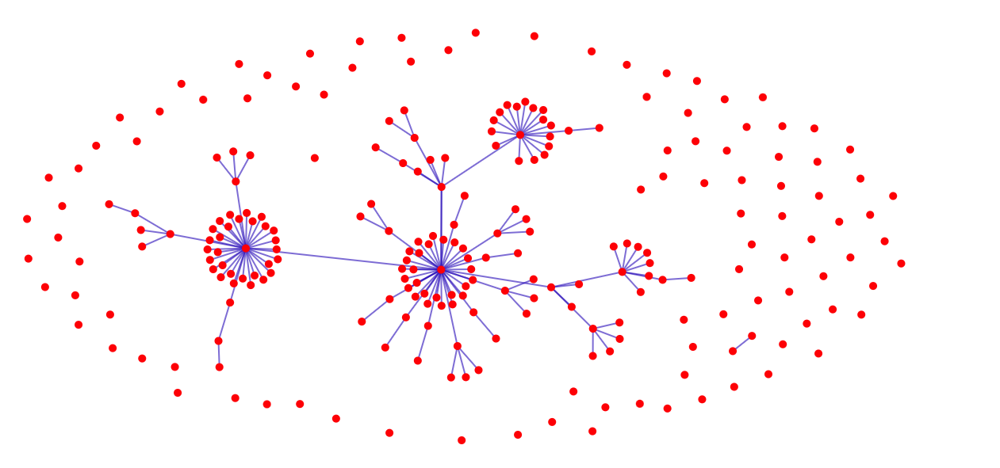
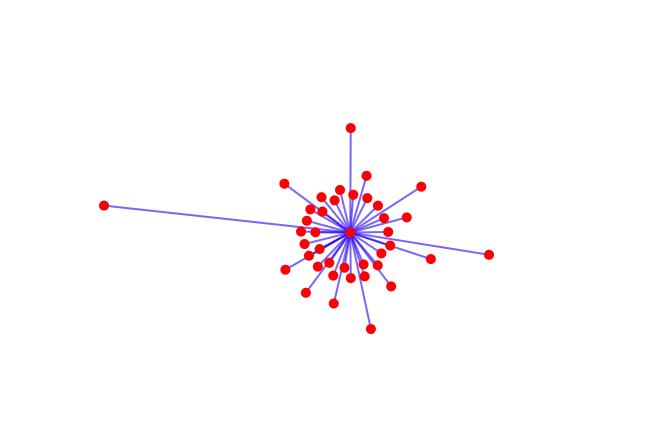

# Network Vizualization using D3.js

This network visualization created using D3.js shows countries' import and export trade relationships. Nodes represent the countries, and the edges represent the trade relations. I extracted the data from a CSV file using Python, used D3.js to create data visualization and added interactions when clicking on the nodes.

dataExtract.ipynb is the python code used to generate the json by processing the provided csv file data.

Technologies:
Python, CSV files, D3.js

Output of the Trade Visualization

